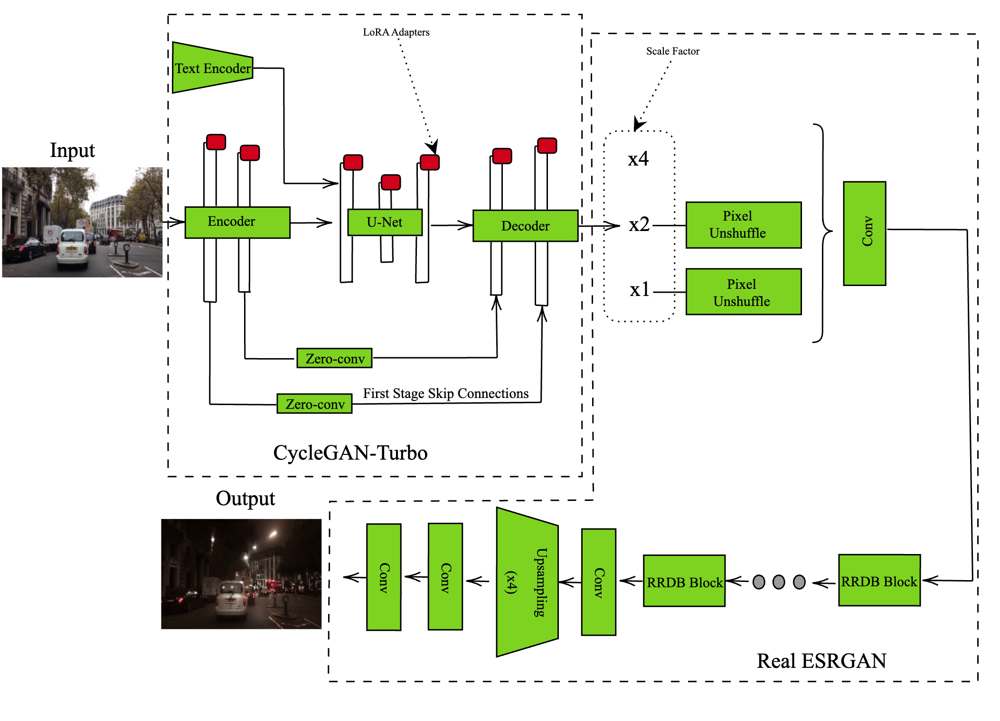
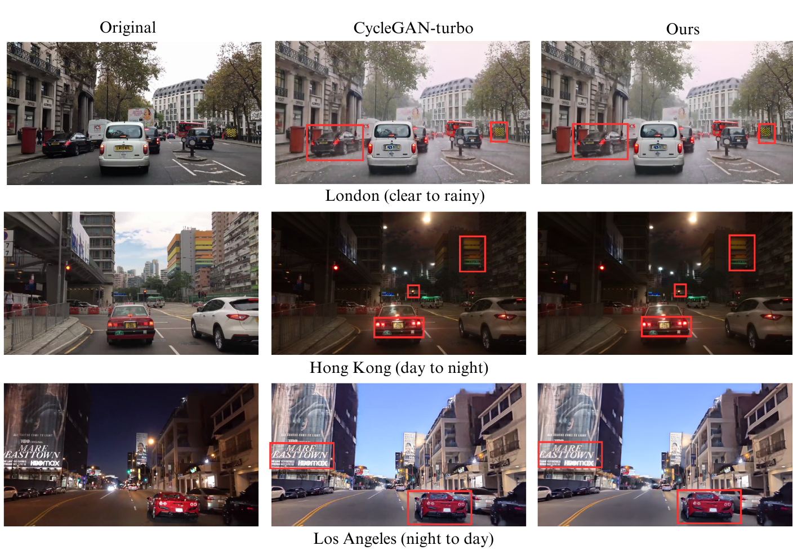
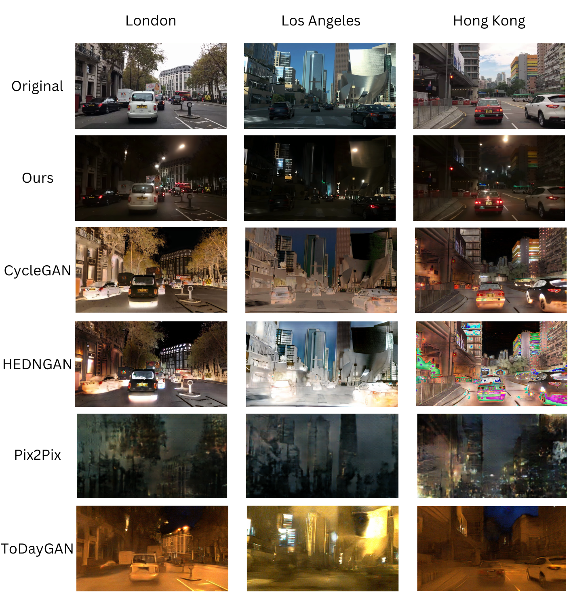

# traffic-pipeline
 
## Overview


## Usage of the code
The code is open-source and free to use. It is aimed for, but not limited to, academic research. We welcome forking of this repository, pull requests, and any contributions in the spirit of open science and open-source code 😍😄 For inquiries about collaboration, you may contact Md Shadab Alam (md_shadab_alam@outlook.com) or Pavlo Bazilinskyy (pavlo.bazilinskyy@gmail.com).

## Getting Started
Tested with Python 3.9.19. To setup the environment run these two commands in a parent folder of the downloaded repository (replace `/` with `\` and possibly add `--user` if on Windows:

**Step 1:**

Clone the repository
```command line
git clone https://github.com/Shaadalam9/traffic-pipeline
```

**Step 2:**

Create a new virtual environment
```command line
python -m venv venv
```

**Step 3:**

Activate the virtual environment
```command line
source venv/bin/activate
```

On Windows use
```command line
venv\Scripts\activate
```

**Step 4:**

Install dependencies
```command line
pip install -r requirements.txt
```

## License
This project is licensed under the MIT License - see the LICENSE file for details.


## Results

### Pipeline Architecture

<div>
<p align="center">

</p>
</div>


### Comparison with CycleGAN-turbo 

<div>
<p align="center">

</p>
</div>


### Comparison for day-to-night translation with other trained models 

<div>
<p align="center">

</p>
</div>
