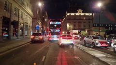

# traffic-pipeline

## Overview
Recent advances in GAN-based architectures have led to innovative methods for image transformation. The lack of diverse environmental data, such as different lighting conditions and seasons in public data, prevents researchers from effectively studying the difference in driver and road user behaviour under varying conditions. This study introduces a deep learning pipeline that combines CycleGAN-turbo and Real-ESRGAN to improve video transformations of the traffic scene. Evaluated using dashcam videos from London, Hong Kong, and Los Angeles, our pipeline shows a 7.97% improvement in T-SIMM for temporal consistency compared to CycleGAN-turbo for night-today transformation for Hong Kong. PSNR and VPQ scores are comparable, but the pipeline performs better in DINO structure similarity and KL divergence, with up to 153.49% better structural fidelity in Hong Kong compared to Pix2Pix and 107.32% better compared to ToDayGAN. This approach demonstrates better realism and temporal coherence in day-tonight , night-today , and clear-to-rainy transitions.


## Usage of the code
The code is open-source and free to use. It is aimed for, but not limited to, academic research. We welcome forking of this repository, pull requests, and any contributions in the spirit of open science and open-source code 😍😄 For inquiries about collaboration, you may contact Md Shadab Alam (md_shadab_alam@outlook.com) or Pavlo Bazilinskyy (pavlo.bazilinskyy@gmail.com).

## Citation
If you use the traffic-pipeline for academic work please cite the following paper:

> Alam, M.S., Parmar, S.H., Martens, M.H., & Bazilinskyy, P. (2025). Deep Learning Approach for Realistic Traffic Video Changes Across Lighting and Weather Conditions. 8th International Conference on Information and Computer Technologies (ICICT). Hilo, Hawaii, USA. 

## Getting Started
Tested with Python 3.9.19. To setup the environment run these two commands in a parent folder of the downloaded repository (replace `/` with `\` and possibly add `--user` if on Windows:

**Step 1:**

Clone the repository
```command line
git clone https://github.com/Shaadalam9/traffic-pipeline
```

**Step 2:**

Create a new virtual environment
```command line
python -m venv venv
```

**Step 3:**

Activate the virtual environment
```command line
source venv/bin/activate
```

On Windows use
```command line
venv\Scripts\activate
```

**Step 4:**

Install dependencies
```command line
pip install -r requirements.txt
```

**Step 5:**

Download the supplementary material from [4TU Research Data](https://doi.org/10.4121/ef03b8d5-a25d-4a83-a371-1c0a11c368d3) and save them in the current folder.

**Step 6:**

Run the main.py script
```command line
python3 main.py
```

### Configuration of project
Configuration of the project needs to be defined in `traffic-pipeline/config`. Please use the `default.config` file for the required structure of the file. If no custom config file is provided, `default.config` is used. The config file has the following parameters:
- **`data`**: Specifies the location of the video files.
- **`transformation`**: Defines the type of transformation to apply.  
  - **Options**:  
    1. `day_to_night`: Convert daytime images to nighttime.  
    2. `night_to_day`: Convert nighttime images to daytime.  
    3. `style_transfer`: Apply a style transfer transformation.  
- **`plotly_template`**: Template used to style graphs in the analysis (e.g., `plotly_white`, `plotly_dark`).

## Data
### Dashcam Videos Used in the Study

This project utilizes dashcam videos from various locations. The following table lists the video links along with the specific timestamps from which the footage was extracted for the study:

| **Location**             | **Day**                                                                                       | **Night**                                                                                     | **Timestamps**         |
|--------------------------|-----------------------------------------------------------------------------------------------|----------------------------------------------------------------------------------------------|------------------------|
| **London (UK)**          | [](https://youtu.be/QI4_dGvZ5yE?t=300)   | [](https://youtu.be/mEXVBiT1eAM?t=1340) | 5:00 - 5:20 (Day) <br> 22:20 - 22:40 (Night) |
| **Hong Kong**            | [](https://youtu.be/ULcuZ3Q02SI?t=380)       | [](https://youtu.be/XaR6qEt-BIY?t=1540)  | 6:20 - 6:40 (Day) <br> 25:40 - 26:00 (Night) |
| **Los Angeles (CA, USA)**| [](https://youtu.be/4uhMg5na888?t=970)       | [](https://youtu.be/eR5vsN1Lq4E?t=2340)  | 16:10 - 16:30 (Day) <br> 39:00 - 39:20 (Night) |


### Note:
- The timestamps indicate the portion of the video used in the study.

## Results

### Pipeline Architecture

<div>
<p align="center">

</p>
</div>


### Comparison with CycleGAN-turbo

<div>
<p align="center">

</p>
</div>

#### CycleGAN-turbo Trained Model
Parmar, G., Park, T., Narasimhan, S., & Zhu, J. Y. (2024). One-step image translation with text-to-image models. arXiv preprint. DOI: [10.48550/arXiv.2403.12036](https://doi.org/10.48550/arXiv.2403.12036)


### Comparison for Day-to-Night Translation with Other Trained Models

<div>
<p align="center">

</p>
</div>

---

## Trained Models Used in the Comparison Study

The following trained models were utilized for the comparison study. The respective papers and weight model links are provided below:
| **Model**    | **Paper**                                                                                   | **Weight Model**                                                                                 |
|--------------|---------------------------------------------------------------------------------------------|-------------------------------------------------------------------------------------------------|
| **CycleGAN** | Zhu, J. Y., Park, T., Isola, P., & Efros, A. A. (2017). Unpaired image-to-image translation using cycle-consistent adversarial networks. *Proceedings of the IEEE International Conference on Computer Vision*, 2223–2232. DOI: [10.1109/ICCV.2017.244](https://doi.org/10.1109/ICCV.2017.244)                                                   | [Weight](https://github.com/junyanz/pytorch-CycleGAN-and-pix2pix)                        |
| **HEDNGAN**  | Mohwald, A., Jenicek, T., & Chum, O. (2023). Dark Side Augmentation: Generating Diverse Night Examples for Metric Learning. *Proceedings of the IEEE/CVF International Conference on Computer Vision*, 11153–11163. DOI: [10.1109/ICCV51070.2023.01024](https://doi.org/10.1109/ICCV51070.2023.01024)                                                   | [Weight](https://github.com/mohwald/gandtr)                                              |
| **Pix2Pix**  | Isola, P., Zhu, J. Y., Zhou, T., & Efros, A. A. (2017). Image-to-image translation with conditional adversarial networks. *Proceedings of the IEEE Conference on Computer Vision and Pattern Recognition*, 1125–1134. DOI: [10.1109/CVPR.2017.632](https://doi.org/10.1109/ICRA.2019.8794387)                                                   | [Weight](https://github.com/junyanz/pytorch-CycleGAN-and-pix2pix)                        |
| **ToDayGAN** | Anoosheh, A., Sattler, T., Timofte, R., Pollefeys, M., & Van Gool, L. (2019). Night-to-day image translation for retrieval-based localization. *2019 International Conference on Robotics and Automation (ICRA)*, 5958–5964. DOI: [10.1109/ICRA.2019.8794387](https://doi.org/10.1109/ICRA.2019.8794387)                                                   | [Weight](https://github.com/AAnoosheh/ToDayGAN)                                          |
                                

### Notes:
- Each model's paper outlines the theoretical framework and methodology behind its functionality.
- The weight model links direct you to the repositories where the pre-trained weights used in this study are available.
- This code requires a CUDA enabled GPU.

## License
This project is licensed under the MIT License - see the LICENSE file for details.

### Acknowledgement:
The code for this repository is inspired by the following works:

1. Parmar, G., Park, T., Narasimhan, S., & Zhu, J. Y. (2024). One-step image translation with text-to-image models. arXiv preprint. DOI: [10.48550/arXiv.2403.12036](https://doi.org/10.48550/arXiv.2403.12036)
2. Wang, X., Xie, L., Dong, C., & Shan, Y. (2021). Real-esrgan: Training real-world blind super-resolution with pure synthetic data. In Proceedings of the IEEE/CVF international conference on computer vision (pp. 1905-1914). DOI: [10.1109/ICCVW54120.2021.00217](https://doi.org/10.1109/ICCVW54120.2021.00217)
